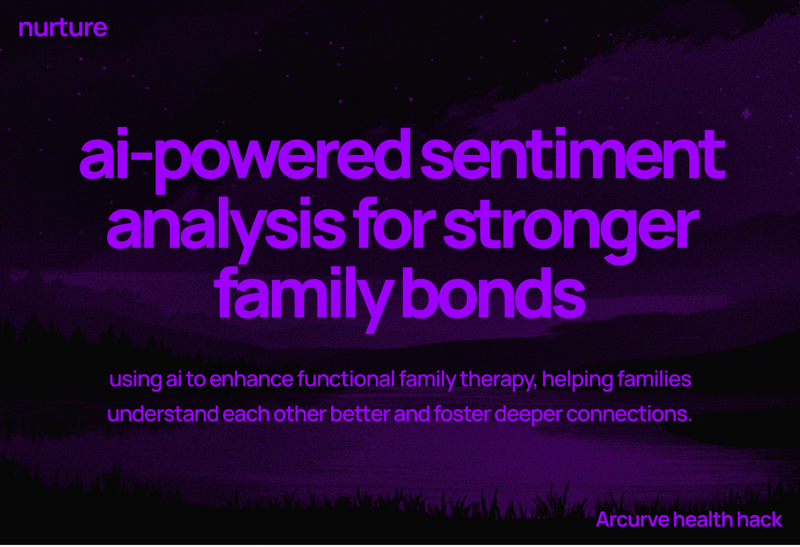
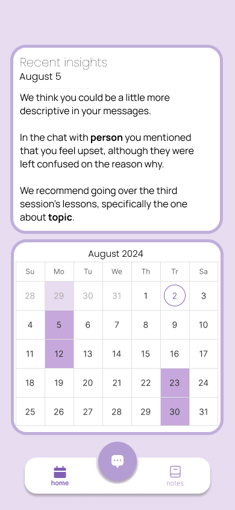
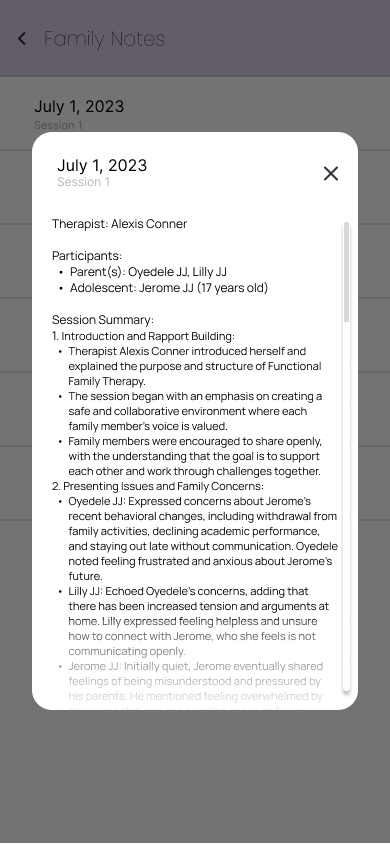
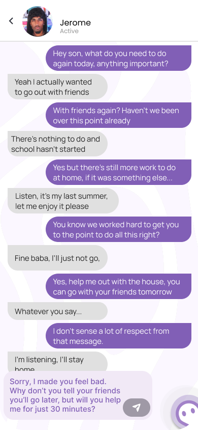
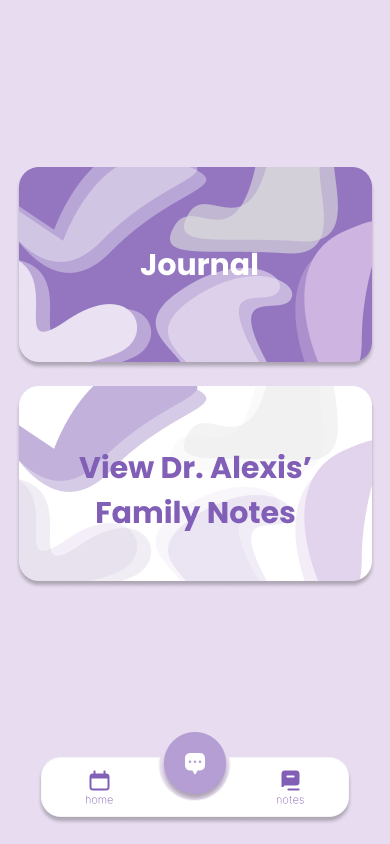
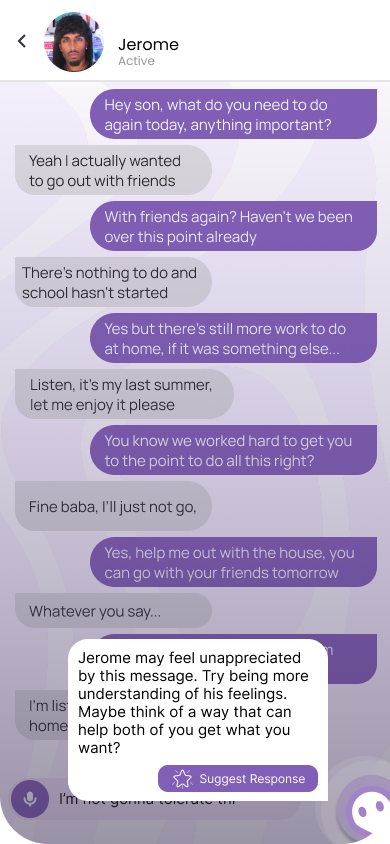
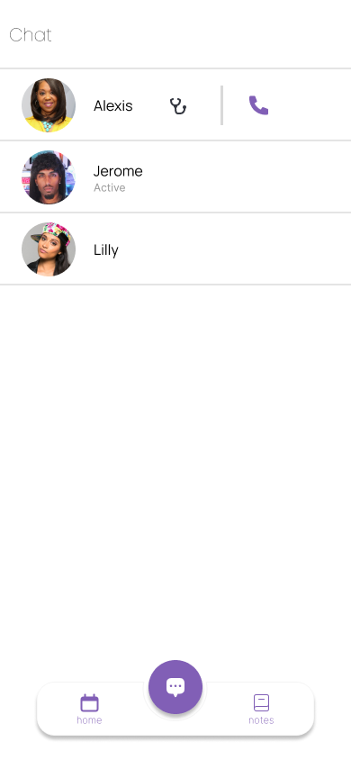

# Introducing nurture

- Use our app with your therapist
- Using sentiment analysis : get personalized reccomendations for your messages
- Access tools and info for FFT
  
# Details.
## Inspiration
We got inspired from common chat platforms such as facebook, messanger and instagram. 
Although, we decided to put our own spin on it, creating a chat platform that better integrates with the alberta health system.
We also got inspired from therapy platforms such as betterhelp, with a tailor to both FFT & User experience for both the client and the therapist
## What it does
### In app messaging
Our app has a messaging feature, allowing you to talk to your parents / family freely, but giving you the help from our nurture buddy.
Nurture buddy uses NLP (natural language processing) as a way to preform sentiment analysis on your messages, allowing for suggestions for your messages.
### Additional features
We also integrate the therapy schedule in the app so that you can keep track of dates and time
Additionally we have a journal directly integrated in the app so that you can keep track of your thoughts, but still give your therapist access.
Finally we have a note logging system, so you can read & review notes from your past therapy sessions 
## How we built it
We built the app using both react and tailwind, as a way to combine our openAI based NLP model with a sleek frontend design.
We started by prototyping our app using [figma prototypes](https://www.figma.com/proto/dsVD8kFH7cPx6X8jCyQUmv/Acurve-Health-Hack?node-id=65-1179&t=uhHz3A6Ll2D0Pn3s-1&scaling=scale-down&content-scaling=fixed&page-id=0%3A1)
Then we implimented the design into the frontend (react), with our AI portion on the backend (tailwind)
We used flask as a way to connect the backend and frontend.

All things we used : Flask, React, OpenAIapi, python

## Challenges we ran into
- Time: 
We had used up a lot of time prototyping, causing frontend issues when we eventually moved the prototypes over (This took a lot longer than expected)
- Backend chat:
We ended up facing many issues with the actual AI portion of the app, causing us to have to rethink the backend a few times
- Look / Feel
We iterated on our design a lot, since we needed to make our UI functional, but also sleek and clean to feel nice to use

## Accomplishments that we're proud of
- Finishing all of this on time 
  - Building a full functional app in under 24 hours
- Our cordination was strong, rumeza was a strong project manager, meaning there was always something we could all work on
## What we learned
We learnt many things along the way, such as:
- Time management
- Project management
- Connectivity from backend -> Frontend (Flask)
- Sleek app development (Got inspo from whatsapp)
- All about FFT and it's problems, as well as the areas we can improve upon it using nurture
## What's next for Nurture
Full chat implimentation. As of right now, we cannot chat with ppl inside the app, although the AI still works. In the future we can impliment this and faurther improve upon some of the features such as our calendar and journalling.
## Image showcase:

